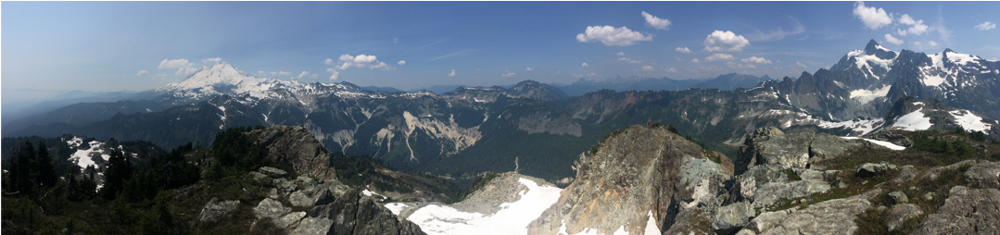
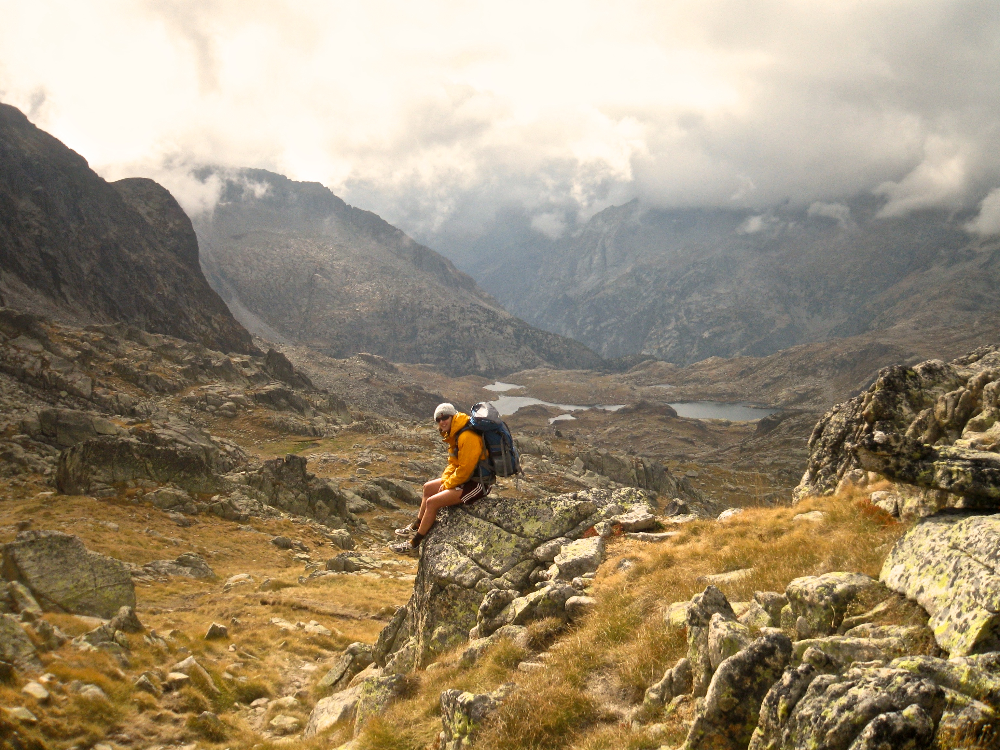

---
---

-----------------------------
  
<link rel="stylesheet" href="style.css" type="text/css">

  
  
My work is driven by questions at the nexus of development and conservation. I am fascinated by the influence of large predators on ecosystem processes, and broadly interested in how land use change and trophic disturbance impact wildlife movement and behavior. What are the evolutionary consequences for migratory species in human-dominated and fragmented landscapes? How do animals move between protected areas? How can we improve ecosystem health and reduce human-wildlife conflict within altered landscapes? 
  
I am currently a PhD student at the University of California, Berkeley in the interdisciplinary Environmental Science, Policy, and Management program. Before joining the [Brashares Lab at Berkeley](https://nature.berkeley.edu/BrasharesGroup/), I managed the Data Analytics & IT Department at [Earthwatch Institute](http://earthwatch.org/), where I led initiatives to engage corporate stakeholders and volunteers in ecology field research. 
  
--------------------------------